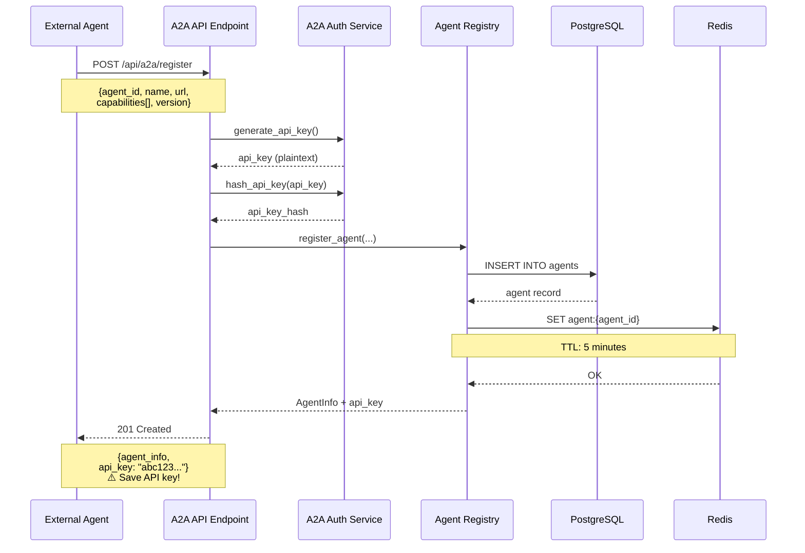
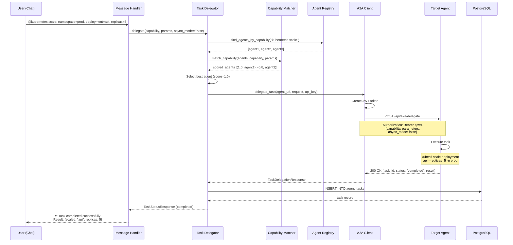
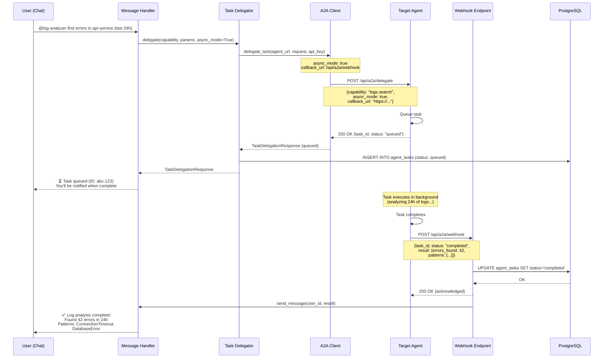
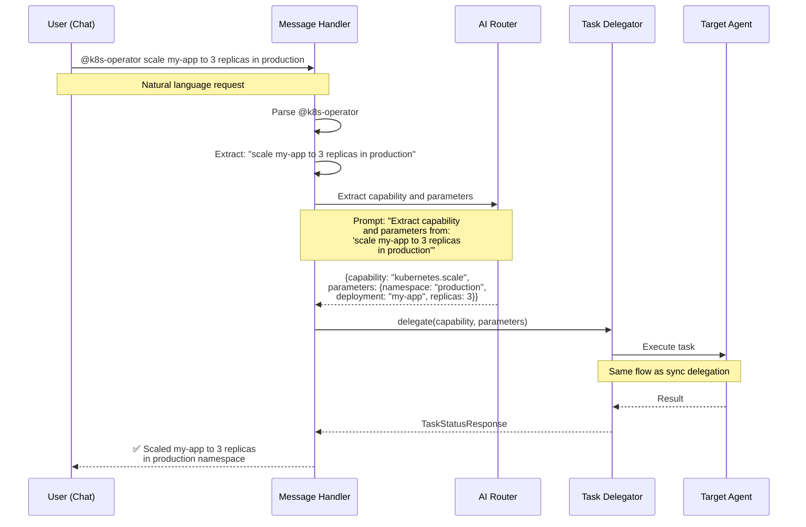
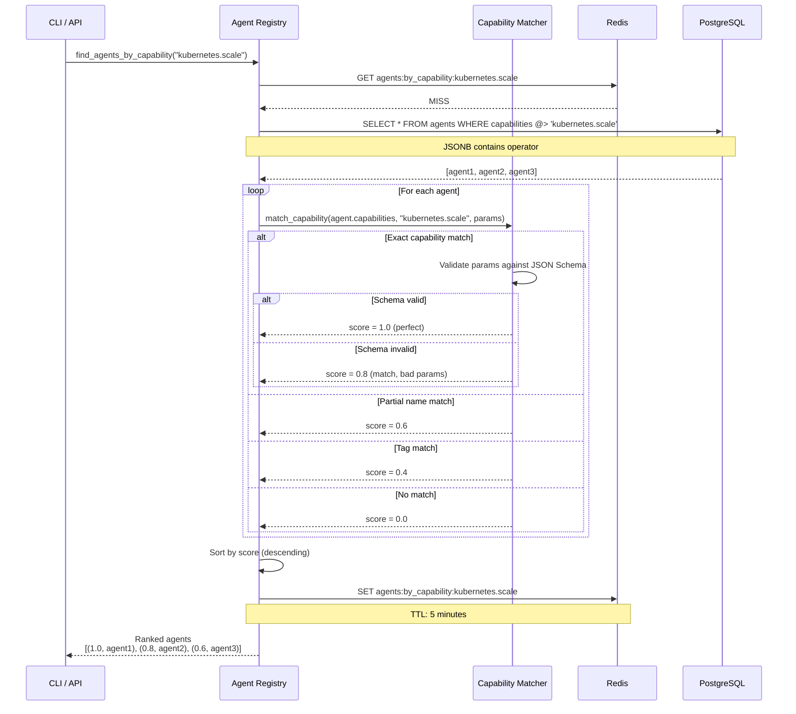
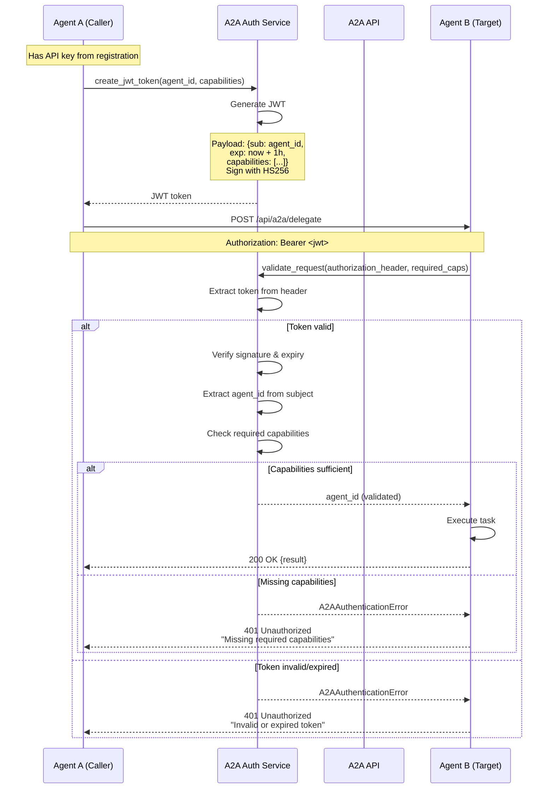
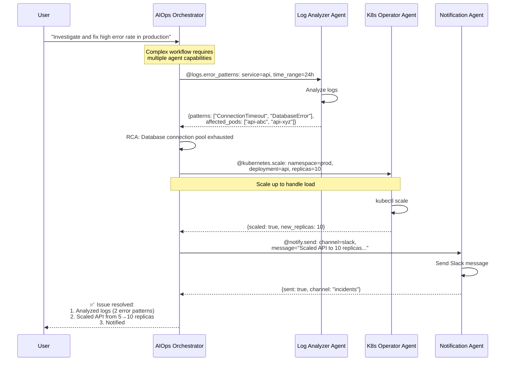
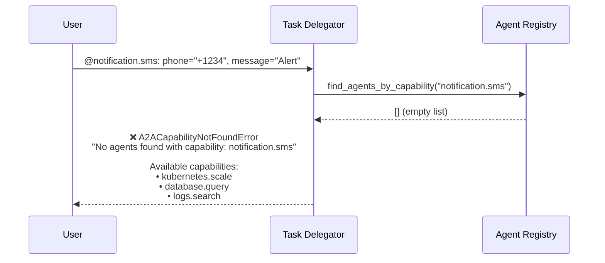
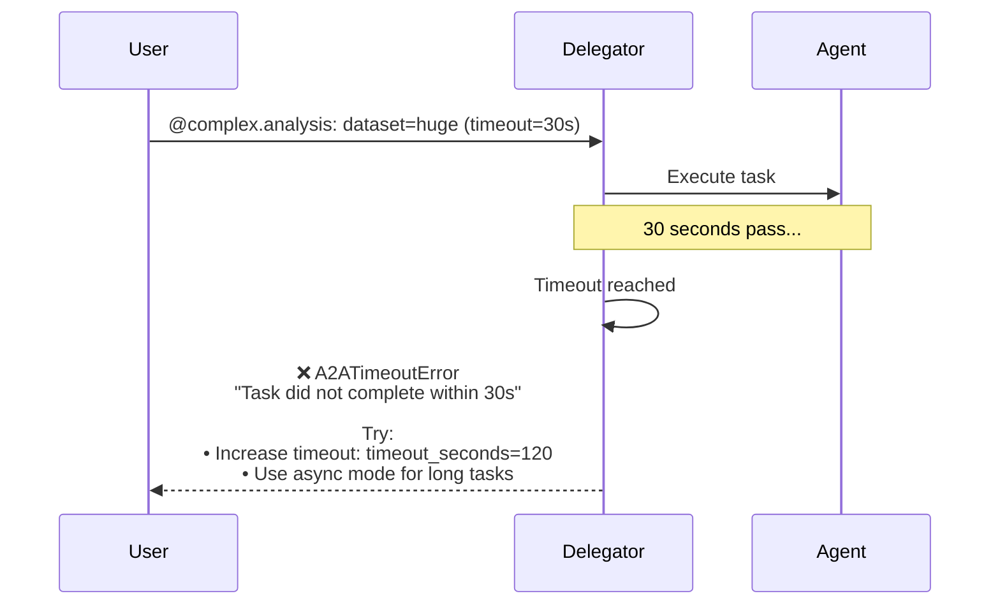

# A2A Integration - Sequence Diagrams

This document contains sequence diagrams illustrating the key flows in the Agent-to-Agent (A2A) integration.

## Table of Contents

- [Agent Registration Flow](#agent-registration-flow)
- [Synchronous Task Delegation](#synchronous-task-delegation)
- [Asynchronous Task Delegation with Webhook](#asynchronous-task-delegation-with-webhook)
- [Natural Language Delegation from Chat](#natural-language-delegation-from-chat)
- [Agent Discovery by Capability](#agent-discovery-by-capability)
- [Authentication Flow](#authentication-flow)
- [Multi-Agent Task Chain](#multi-agent-task-chain)

---

## Agent Registration Flow

This diagram shows how an external agent registers itself with the AIOps Orchestrator.



**Key Points:**
- API key is returned **only once** during registration
- API key is hashed (SHA-256) before storage
- Agent info is cached in Redis with 5-minute TTL
- PostgreSQL provides persistence; Redis provides fast lookups

---

## Synchronous Task Delegation

This diagram shows the complete sync delegation flow where the orchestrator waits for task completion.



**Key Points:**
- Synchronous mode blocks until task completes or times out
- Capability matcher scores agents (1.0 = perfect match)
- JWT token created per request for authentication
- Full audit trail stored in `agent_tasks` table

---

## Asynchronous Task Delegation with Webhook

This diagram shows async delegation where the task runs in the background and notifies via webhook when complete.



**Key Points:**
- Async mode returns immediately after queuing
- Agent calls webhook when task completes
- User receives notification in chat with results
- Supports long-running tasks (minutes to hours)

---

## Natural Language Delegation from Chat

This diagram shows the NLP extraction flow when users use natural language instead of structured syntax.



**Key Points:**
- Users can use natural language instead of structured syntax
- AI (Gemini 2.0 Flash) extracts capability and parameters
- Falls back to structured format on extraction failure
- Provides better UX for non-technical users

---

## Agent Discovery by Capability

This diagram shows how the system discovers and ranks agents based on capability requirements.



**Key Points:**
- JSONB queries in PostgreSQL for capability filtering
- Scoring algorithm: 1.0 (perfect) → 0.8 → 0.6 → 0.4 → 0.0
- Results cached in Redis for 5 minutes
- JSON Schema validation for parameter checking

---

## Authentication Flow

This diagram shows the JWT authentication flow for agent-to-agent requests.



**Key Points:**
- JWT tokens expire after 1 hour (configurable)
- Tokens include capability claims for authorization
- HS256 algorithm (symmetric signing)
- Capability-based access control (CBAC)

---

## Multi-Agent Task Chain

This diagram shows how multiple agents can be chained together for complex workflows.



**Key Points:**
- Orchestrator chains multiple agent calls
- Each agent specializes in one capability
- Results from one agent feed into next step
- Full workflow automation with human oversight

---

## Complete System Flow with All Components

This comprehensive diagram shows how all A2A components work together in the AIOps Orchestrator.

```mermaid
graph TB
    %% User Interaction
    User[👤 User via Chat] -->|@agent or /a2a| MH[Message Handler]
    
    %% Message Handler Decision
    MH -->|Command| CMD{Command Type?}
    CMD -->|/a2a agents| AREG[Agent Registry]
    CMD -->|/a2a status| HEALTH[Health Check API]
    CMD -->|@delegation| DEL[Task Delegator]
    
    %% Agent Registry Flow
    AREG -->|Query| DB[(PostgreSQL)]
    AREG -->|Cache| Redis[(Redis)]
    DB -->|Agent List| AREG
    Redis -->|Cached Data| AREG
    AREG -->|Response| User
    
    %% Health Check Flow
    HEALTH -->|Status Query| REG2[Agent Registry]
    REG2 -->|Stats| HEALTH
    HEALTH -->|Response| User
    
    %% Delegation Flow
    DEL -->|Find Agents| REG3[Agent Registry]
    REG3 -->|Candidates| MATCH[Capability Matcher]
    MATCH -->|Scored Agents| DEL
    DEL -->|Best Match| CLIENT[A2A Client]
    
    %% Authentication
    CLIENT -->|Generate Token| AUTH[A2A Auth]
    AUTH -->|JWT| CLIENT
    
    %% External Agent Communication
    CLIENT -->|HTTP + JWT| AGENT[🤖 External Agent]
    AGENT -->|Result| CLIENT
    CLIENT -->|Response| DEL
    
    %% Audit & Notification
    DEL -->|Log Task| DB
    DEL -->|Update Metrics| PROM[Prometheus]
    DEL -->|Result| MH
    MH -->|Formatted Response| User
    
    %% Async Flow (Webhook)
    AGENT -.->|Webhook Callback| WEBHOOK[Webhook Endpoint]
    WEBHOOK -->|Update Status| DB
    WEBHOOK -->|Notify User| MH
    
    %% Monitoring
    PROM -->|Scrape| METRICS[/metrics Endpoint]
    METRICS -->|Expose| PROM
    PROM -->|Visualize| GRAFANA[📊 Grafana]
    
    style User fill:#e1f5ff
    style AGENT fill:#ffe1e1
    style DB fill:#fff4e1
    style Redis fill:#ffe1f5
    style PROM fill:#e1ffe1
    style GRAFANA fill:#e1ffe1
```

**Component Responsibilities:**

| Component | Responsibility |
|---|---|
| **Message Handler** | Routes @mentions and /a2a commands |
| **Task Delegator** | Orchestrates task delegation lifecycle |
| **Agent Registry** | Manages agent registration and discovery |
| **Capability Matcher** | Scores agents by capability match |
| **A2A Client** | HTTP communication with external agents |
| **A2A Auth** | JWT generation and validation |
| **Webhook Endpoint** | Receives async task completion callbacks |
| **PostgreSQL** | Persists agents, tasks, audit trail |
| **Redis** | Caches agent info (5min TTL) |
| **Prometheus** | Collects A2A metrics |

---

## Usage Examples

### Example 1: Natural Language Delegation

```
User: @k8s-operator restart the api-server pods in production

Flow:
1. Message Handler detects @ prefix
2. AI extracts: capability="kubernetes.restart", params={namespace: "production", deployment: "api-server"}
3. Task Delegator finds k8s-operator-agent (score: 1.0)
4. A2A Client sends request with JWT
5. Agent executes: kubectl rollout restart deployment api-server -n production
6. User receives: "✅ Restarted api-server pods in production"
```

### Example 2: Structured Delegation

```
User: @database.query: database=analytics, query="SELECT COUNT(*) FROM errors WHERE created_at > NOW() - INTERVAL '1 hour'"

Flow:
1. Message Handler parses structured format
2. Capability: "database.query"
3. Parameters: {database: "analytics", query: "SELECT..."}
4. Delegator finds db-ops-agent
5. Agent executes query
6. User receives: "✅ Query result: 1,247 errors in last hour"
```

### Example 3: List Available Agents

```
User: /a2a agents kubernetes

Response:
🤖 Registered Agents (2 total)

🟢 **K8s Operator Agent** (`k8s-operator-agent`)
   • Capabilities: kubernetes.scale, kubernetes.restart, kubernetes.describe
   • Status: online

🟡 **K8s Monitor Agent** (`k8s-monitor-agent`)
   • Capabilities: kubernetes.health, kubernetes.events
   • Status: degraded
```

---

## Metrics & Observability

All A2A operations emit Prometheus metrics for monitoring:

```prometheus
# Agent registration
aiagent_a2a_agents_registered 4
aiagent_a2a_agents_online 3

# Task delegation
aiagent_a2a_tasks_delegated_total{to_agent="k8s-operator",capability="kubernetes.scale",status="completed"} 127
aiagent_a2a_task_duration_seconds{capability="kubernetes.scale",status="completed"} 2.5

# Authentication
aiagent_a2a_auth_failures_total{reason="invalid_token"} 3

# Webhooks
aiagent_a2a_webhooks_sent_total{status="success"} 89
aiagent_a2a_webhooks_received_total{task_status="completed"} 76
```

---

## Error Handling

### Scenario: No Capable Agent Found



### Scenario: Task Timeout



---

## Best Practices

1. **Use Async for Long Tasks**: Tasks >30s should use `async_mode=True`
2. **Provide Webhook URL**: Set `A2A_WEBHOOK_URL` for async callbacks
3. **Monitor Metrics**: Alert on `aiagent_a2a_auth_failures_total`
4. **Cache Busting**: Redis TTL is 5 minutes; manual flush if needed
5. **Capability Naming**: Use dot notation: `domain.action` (e.g., `kubernetes.scale`)
6. **JSON Schema**: Always provide `parameters_schema` for validation
7. **Error Handling**: Implement retries for `A2ATimeoutError`

---

## Related Documentation

- [A2A Integration Guide](a2a-integration.md) - Complete setup and API reference
- [Architecture Overview](architecture.md) - System design and component interactions
- [API Reference](../README.md#api-reference) - All REST endpoints
- [Deployment Checklist](../DEPLOYMENT_CHECKLIST.md) - Production deployment steps

---

**Last Updated**: 2026-07-26  
**Version**: 1.0.0
