# AIOps Feature Documentation

## Overview

The AIOps (AI for IT Operations) module provides **proactive, autonomous Kubernetes cluster management** through continuous monitoring, intelligent anomaly detection, AI-powered root cause analysis, and human-in-the-loop remediation playbooks.

It transforms the agent from a reactive chatbot into a proactive SRE assistant that watches your cluster 24/7.

---

## Architecture

```
┌─────────────────────────────────────────────────────────────────┐
│                        Simple AI Agent                           │
│                                                                  │
│  ┌────────────┐   events   ┌─────────────┐   matches   ┌──────┐ │
│  │K8sWatchLoop│──────────▶│ RuleEngine  │────────────▶│      │ │
│  │  (30s poll)│            └─────────────┘             │Play- │ │
│  └────────────┘                                        │book  │ │
│       │                                                │Exec  │ │
│       │ K8s API    ┌────────────────┐  LOW risk step   │utor  │ │
│       └──────────▶ │KubernetesClient│◀─────────────────│      │ │
│                    └────────────────┘                  └──┬───┘ │
│  ┌────────────┐                                           │      │
│  │Alertmanager│──webhook──▶ /api/webhook/alertmanager     │MED/  │
│  │(Prometheus)│                                           │HIGH  │
│  └────────────┘                                           ▼      │
│                                                   ┌──────────────┐│
│                                                   │ApprovalMgr   ││
│                                                   │(Redis-backed)││
│                                                   └──────┬───────┘│
│                                                          │         │
│  ┌──────────┐  ┌──────────┐  ┌──────────┐               │notify  │
│  │RCAEngine │  │LogAnal-  │  │Telegram/ │◀──────────────┘         │
│  │(GPT-4o)  │  │yzer      │  │Discord   │                         │
│  └──────────┘  └──────────┘  └──────────┘                         │
└─────────────────────────────────────────────────────────────────┘
```

---

## Components

### 1. K8s WatchLoop (`src/monitoring/watchloop.py`)

Background asyncio task that polls the Kubernetes cluster every `K8S_WATCHLOOP_INTERVAL` seconds (default: 30s).

**What it detects:**

| Check | Event Type | Severity |
|-------|-----------|----------|
| Pod in `CrashLoopBackOff` or `Error` | `crash_loop` | critical |
| Pod killed by OOM reaper (`OOMKilled`) | `oom_killed` | critical |
| Node with `NotReady` condition | `not_ready_node` | critical |
| Deployment with 0/N replicas available | `replication_failure` | critical |

**Deduplication:** Each issue fires an event exactly once — tracked in `_known_issues`. When the resource recovers, the key is automatically removed so a re-occurrence fires a new alert.

**Configuration:**
```env
K8S_WATCHLOOP_ENABLED=true
K8S_WATCHLOOP_INTERVAL=30
AIOPS_NOTIFICATION_CHANNEL=telegram:123456789
AUTO_REMEDIATION_ENABLED=true
```

---

### 2. Rule Engine (`src/aiops/rule_engine.py`)

Evaluates each `ClusterEvent` against a set of `Rule` objects. When a rule matches, it returns the associated playbook ID.

**Built-in Rules:**

| ID | Name | Condition | Playbook |
|----|------|-----------|----------|
| rule-001 | CrashLoop Auto-Restart | `crash_loop` (critical) | `crash_loop_remediation` |
| rule-002 | OOMKill Memory Increase | `oom_killed` (critical) | `oom_kill_remediation` |
| rule-003 | NotReady Node Evacuation | `not_ready_node` (critical) | `node_not_ready_remediation` |
| rule-004 | Replication Failure Rollback | `replication_failure` (critical) | `deployment_rollback` |

**Custom Rules:**
```python
from src.aiops.rule_engine import Rule, RuleCondition
engine.add_rule(Rule(
    id="rule-custom-01",
    name="Staging Crash Alert",
    condition=RuleCondition.CRASH_LOOP,
    playbook_id="crash_loop_remediation",
    namespace_filter="staging",
    severity_filter="critical",
))
```

---

### 3. Playbook Registry & Executor (`src/aiops/playbooks.py`)

**PlaybookRegistry** stores all available remediation playbooks. **PlaybookExecutor** runs them.

**Built-in Playbooks:**

| Playbook ID | Steps | Risk |
|-------------|-------|------|
| `crash_loop_remediation` | Describe Pod → Fetch Logs → Restart Pod → Verify | LOW, LOW, MEDIUM, LOW |
| `oom_kill_remediation` | Get Current Limits → Increase Memory Limit | LOW, HIGH |
| `deployment_rollback` | Get Rollout History → Rollback → Check Status | LOW, HIGH, LOW |
| `node_not_ready_remediation` | Describe Node → Cordon → Drain | LOW, MEDIUM, HIGH |
| `scale_up_on_load` | Scale Deployment | MEDIUM |

**Risk Level Routing:**

```
LOW    → MCP tool called immediately, output appended to run
MEDIUM → ApprovalManager posts approval request, execution paused
HIGH   → ApprovalManager posts HIGH RISK warning, execution paused
```

---

### 4. Approval Manager (`src/services/approval_manager.py`)

Redis-backed human-in-the-loop gate for MEDIUM and HIGH risk actions.

**Approval Flow:**
1. Executor encounters MEDIUM/HIGH step → calls `request_approval()`
2. Manager stores pending approval in Redis with TTL (`APPROVAL_TIMEOUT_SECONDS`)
3. User receives a formatted approval message in chat
4. User replies `approve <id>` or `reject <id>`
5. Manager executes the tool via MCP (on approve) or marks rejected

**Approval Message Format:**
```
🟠 Approval Required [MEDIUM]

Action: Delete pod to trigger fresh restart
Tool: `k8s_restart_pod`
Parameters: `{"pod_name": "nginx-abc", "namespace": "prod"}`

Reply with `approve a1b2c3d4` to proceed or `reject a1b2c3d4` to cancel.
This request expires in 15 minutes.
```

**Supported approval commands:**
- `approve <8-char-id>`, `yes <8-char-id>`, `confirm <8-char-id>`
- `reject <8-char-id>`, `no <8-char-id>`, `cancel <8-char-id>`

---

### 5. RCA Engine (`src/aiops/rca_engine.py`)

AI-powered root cause analysis using GPT-4o with an SRE-specialist system prompt.

**Input:** `incident_context` dict containing pod events, logs, restart count, metrics.

**Output — `RCAReport`:**
```
🔍 Root Cause Analysis

Pattern: OOMKill
Root Cause: Container exceeded memory limits due to a memory leak in connection pool
Confidence: 87%

Supporting Evidence:
  - OOM kill detected in pod logs at 14:23:01
  - 12 restarts in the last hour

Recommended Actions:
  1. Increase memory limit from 512Mi to 1Gi
  2. Profile application memory usage with heap dump
  3. Add memory utilization alert at 80% threshold
```

**Fallback:** If AI is unavailable, heuristic rules based on log keywords and restart counts provide a baseline analysis.

**Failure Patterns:** `OOMKill | CrashLoop | ConfigError | NetworkTimeout | ImagePullError | ResourceExhaustion | DependencyFailure | NodePressure | StorageFailure | Unknown`

---

### 6. Log Analyzer (`src/aiops/log_analyzer.py`)

Regex-based pattern matching with optional AI enrichment.

**Detected Patterns (14 built-in):**

| Pattern | Severity | Example Match |
|---------|----------|---------------|
| OOMKill | CRITICAL | `out of memory` |
| Segfault | CRITICAL | `SIGSEGV` |
| Panic | CRITICAL | `panic: runtime error` |
| Java StackTrace | ERROR | `Exception in thread` |
| Python Traceback | ERROR | `Traceback (most recent)` |
| Connection Refused | ERROR | `ECONNREFUSED` |
| Connection Timeout | ERROR | `context deadline exceeded` |
| DNS Failure | ERROR | `no such host` |
| TLS/SSL Error | ERROR | `x509: certificate` |
| Authentication | ERROR | `unauthorized` |
| Disk Full | CRITICAL | `no space left on device` |
| File Not Found | WARNING | `ENOENT` |
| Port In Use | ERROR | `EADDRINUSE` |
| Database Error | ERROR | `deadlock detected` |

---

## Sequence Diagrams

### Diagram 1 — Cluster Event Detection & Alert Notification

```mermaid
sequenceDiagram
    participant K8s as Kubernetes API
    participant WL as K8sWatchLoop
    participant RE as RuleEngine
    participant Router as MessageRouter
    participant User as SRE (Telegram/Discord)

    loop Every 30 seconds
        WL->>K8s: list_pods (all namespaces)
        K8s-->>WL: pod list
        WL->>WL: detect CrashLoop / OOMKilled pods

        WL->>K8s: get_not_ready_nodes()
        K8s-->>WL: node list
        WL->>WL: detect NotReady nodes

        WL->>K8s: list_deployments (each namespace)
        K8s-->>WL: deployment list
        WL->>WL: detect 0-replica deployments
    end

    Note over WL: New issue found (not in _known_issues)

    WL->>WL: Create ClusterEvent(type, severity, resource)
    WL->>WL: Add to _known_issues (dedup)
    WL->>RE: evaluate(event.to_dict())
    RE->>RE: Match event_type + severity_filter
    RE-->>WL: [(rule-001, "crash_loop_remediation")]

    WL->>Router: send_message(ch_type, ch_id, alert_msg)
    Router->>User: 🚨 AIOps Alert [CRITICAL]\nType: crash_loop\nResource: Pod/nginx-abc in prod\nPlaybooks queued: crash_loop_remediation
```



---

### Diagram 2 — Auto-Remediation with PlaybookExecutor (LOW Risk)

```mermaid
sequenceDiagram
    participant WL as K8sWatchLoop
    participant PE as PlaybookExecutor
    participant MCP as MCPManager
    participant K8s as Kubernetes API
    participant Router as MessageRouter
    participant User as SRE

    WL->>PE: execute("crash_loop_remediation", context, channel_type, channel_id)
    PE->>PE: Lookup playbook in registry
    PE->>PE: status = "running"

    Note over PE: Step 1: Describe Pod (LOW risk)
    PE->>MCP: call_tool("k8s_describe_resource", {pod, namespace})
    MCP->>K8s: describe pod nginx-abc
    K8s-->>MCP: pod conditions + events
    MCP-->>PE: pod description
    PE->>Router: ▶️ Describe Pod: [output]
    Router->>User: Progress notification

    Note over PE: Step 2: Fetch Logs (LOW risk)
    PE->>MCP: call_tool("k8s_analyze_logs", {pod, namespace, tail=100})
    MCP->>K8s: get pod logs
    K8s-->>MCP: log lines
    MCP-->>PE: log analysis result
    PE->>Router: ▶️ Fetch Recent Logs: [output]
    Router->>User: Progress notification

    Note over PE: Step 3: Restart Pod (MEDIUM risk → pause)
    PE->>PE: status = "awaiting_approval"
    PE->>PE: Stop execution, request approval
```



---

### Diagram 3 — Human-in-the-Loop Approval for MEDIUM/HIGH Risk

```mermaid
sequenceDiagram
    participant PE as PlaybookExecutor
    participant AM as ApprovalManager
    participant Redis as Redis
    participant Router as MessageRouter
    participant User as SRE
    participant MCP as MCPManager
    participant K8s as Kubernetes API

    PE->>AM: request_approval(tool="k8s_restart_pod", params, risk=MEDIUM)
    AM->>AM: Generate approval_id (UUID)
    AM->>Redis: SETEX approval:<uuid> <TTL> <approval_json>
    Redis-->>AM: OK
    AM->>Router: send_message(channel_target, approval_message)
    Router->>User: 🟠 Approval Required [MEDIUM]\nAction: Restart pod nginx-abc\nReply: approve a1b2c3d4

    alt User approves
        User->>Router: "approve a1b2c3d4"
        Router->>AM: process_response("approve a1b2c3d4", user_id, channel)
        AM->>Redis: SCAN approval:* (find by short_id)
        Redis-->>AM: approval data
        AM->>MCP: call_tool("k8s_restart_pod", {pod, namespace})
        MCP->>K8s: DELETE pod nginx-abc
        K8s-->>MCP: pod deleted (controller recreates)
        MCP-->>AM: success
        AM->>Redis: UPDATE status=executed
        AM-->>Router: ✅ Restart pod executed successfully.
        Router->>User: ✅ Execution confirmed

    else User rejects
        User->>Router: "reject a1b2c3d4"
        Router->>AM: process_response("reject a1b2c3d4", user_id, channel)
        AM->>Redis: UPDATE status=rejected
        AM-->>Router: ❌ Action rejected by user
        Router->>User: ❌ Action cancelled

    else Timeout
        Note over Redis: TTL expires
        AM->>AM: status=expired on next lookup
        Router->>User: (no action taken)
    end
```



---

### Diagram 4 — AI Root Cause Analysis

```mermaid
sequenceDiagram
    actor SRE as SRE
    participant Bot as AI Agent
    participant RCA as RCAEngine
    participant K8s as KubernetesClient
    participant AI as GitHub Models (GPT-4o)

    SRE->>Bot: "analyze incident nginx-abc in prod"
    Bot->>K8s: get_pod("nginx-abc", "prod")
    K8s-->>Bot: pod details (status, restarts=14)
    Bot->>K8s: get_pod_logs("nginx-abc", tail=200)
    K8s-->>Bot: log lines
    Bot->>K8s: list events for pod
    K8s-->>Bot: K8s events (Backoff, OOMKilling)

    Bot->>RCA: analyze(incident_context)
    RCA->>RCA: _build_context_message(ctx)
    Note over RCA: Formats events + logs + metrics\ninto structured prompt

    RCA->>AI: POST /chat/completions\n[system: SRE specialist]\n[user: incident context]
    Note over AI: Analyzes failure pattern,\nevidence, root cause
    AI-->>RCA: JSON { root_cause, confidence, pattern, actions }

    RCA->>RCA: Parse JSON → RCAReport
    RCA-->>Bot: RCAReport(root_cause, confidence=0.87, pattern="OOMKill")

    Bot->>SRE: 🔍 Root Cause Analysis\nPattern: OOMKill\nCause: Memory leak in connection pool\nConfidence: 87%\n\nActions:\n1. Increase memory limit\n2. Profile heap usage
```



---

### Diagram 5 — Log Analysis Flow

```mermaid
sequenceDiagram
    actor SRE as SRE
    participant Bot as AI Agent
    participant LA as LogAnalyzer
    participant K8s as KubernetesClient
    participant AI as GitHub Models (GPT-4o-mini)

    SRE->>Bot: "check logs for nginx-abc"
    Bot->>K8s: get_pod_logs("nginx-abc", tail=500)
    K8s-->>Bot: raw log text

    Bot->>LA: analyze_with_ai(pod_name, namespace, logs, ai_client)

    Note over LA: Phase 1 — Regex scan
    LA->>LA: Compile 14 regex patterns
    LA->>LA: Scan each line for matches
    LA->>LA: Count + deduplicate matches
    LA->>LA: Sort by severity (CRITICAL > ERROR > WARNING)

    Note over LA: Phase 2 — AI enrichment
    LA->>AI: "Analyze these K8s pod logs...\nDetected: OOMKill, Connection Refused\nLog sample: [last 30 lines]"
    AI-->>LA: "Container is running out of memory due to an unbounded cache. The connection refused errors are a downstream effect. Recommend: increase memory limits and implement cache eviction policy."
    LA->>LA: Attach ai_classification to result

    LA-->>Bot: LogAnalysisResult(patterns=[OOMKill, ConnRefused], ai_classification=...)
    Bot->>SRE: 📋 Log Analysis: nginx-abc (prod)\nLines: 312 | Errors: 47 | Warnings: 12\n\n🔴 OOMKill (3 occurrences)\n🟠 Connection Refused (44 occurrences)\n\nAI Analysis: Container is running out of memory...
```



---

### Diagram 6 — Alertmanager Webhook → AIOps

```mermaid
sequenceDiagram
    participant Prom as Prometheus
    participant AM as Alertmanager
    participant Webhook as /api/webhook/alertmanager
    participant RE as RuleEngine
    participant PE as PlaybookExecutor
    participant Router as MessageRouter
    participant User as SRE

    Note over Prom: Scrapes /metrics every 15s
    Prom->>Prom: Evaluate alert_rules.yml
    Note over Prom: KubePodCrashLooping fires\nfor > 2 minutes

    Prom->>AM: POST alert (CrashLoop, firing)
    AM->>AM: Apply routing rules
    AM->>AM: Wait group_wait (30s)
    AM->>Webhook: POST /api/webhook/alertmanager\n{alerts: [{status: firing, labels: {alertname, namespace, pod}}]}

    Webhook->>Webhook: Verify signature
    Webhook->>RE: evaluate({event_type: alertmanager_firing, ...})
    RE-->>Webhook: matched rules

    Webhook->>Router: send_message(aiops_channel, alert_summary)
    Router->>User: 🚨 Alertmanager: KubePodCrashLooping\nNamespace: prod, Pod: nginx-abc

    alt AUTO_REMEDIATION_ENABLED
        Webhook->>PE: execute(playbook_id, context)
        PE-->>Router: Playbook execution progress
        Router->>User: Progress / approval requests
    end
```



---

## Production Configuration

### Required Environment Variables

```env
# AIOps Core
K8S_WATCHLOOP_ENABLED=true
K8S_WATCHLOOP_INTERVAL=30
AIOPS_NOTIFICATION_CHANNEL=telegram:YOUR_CHAT_ID
AUTO_REMEDIATION_ENABLED=false          # Start with false; enable after testing

# Approval Gate
APPROVAL_TIMEOUT_SECONDS=900            # 15 minutes

# Kubernetes Access (in Docker)
KUBECONFIG=/app/.kube/config
K8S_CONTEXT=k3s-ssh-tunnel              # Optional: pin context
```

### Recommended Production Settings

| Setting | Development | Production |
|---------|------------|------------|
| `AUTO_REMEDIATION_ENABLED` | `true` | `false` (start cautious) |
| `K8S_WATCHLOOP_INTERVAL` | 30s | 60s |
| `APPROVAL_TIMEOUT_SECONDS` | 300 | 900 |
| Playbook risk gate | MEDIUM approval | HIGH approval required |

### Enabling Auto-Remediation Safely

1. **Start with `AUTO_REMEDIATION_ENABLED=false`** — receive alerts, review playbook suggestions
2. **Enable for LOW-risk only** — LOW risk steps (read-only + pod restarts) run immediately
3. **Accept approval prompts for MEDIUM/HIGH** — drain, rollback, memory patches need your `approve <id>`
4. **Full auto** — only after 2+ weeks of successful supervised operation

---

## Monitoring the AIOps System

### Health Check Response

```
GET /health

{
  "status": "healthy",
  "aiops": {
    "watchloop_running": true,
    "watchloop_interval": 30,
    "known_issues": 0,
    "auto_remediation": false
  }
}
```

### Key Log Events

| Log Key | Meaning |
|---------|---------|
| `k8s_watchloop_started` | WatchLoop running |
| `watchloop_event_detected` | New anomaly found |
| `rule_matched` | Rule triggered a playbook |
| `playbook_started` | PlaybookExecutor began a run |
| `playbook_step_running` | MCP tool being called |
| `playbook_awaiting_approval` | Paused, waiting for MEDIUM/HIGH approval |
| `playbook_completed` | All steps done |
| `approval_requested` | Approval message sent to user |
| `approval_executing` | User approved, tool being called |
| `approval_rejected` | User rejected the action |
| `watchloop_node_recovered` | Previously NotReady node is now healthy |
| `watchloop_deployment_recovered` | Zero-replica deployment is now healthy |

### Prometheus Metrics (when `/metrics` endpoint enabled)

| Metric | Description |
|--------|-------------|
| `aiops_events_total{type="crash_loop"}` | Total detected crash events |
| `aiops_playbooks_total{status="completed"}` | Playbook execution outcomes |
| `aiops_approvals_total{outcome="approved"}` | Approval gate outcomes |

---

## Built-in Playbook Reference

### `crash_loop_remediation`

| Step | Tool | Risk | Description |
|------|------|------|-------------|
| 1 | `k8s_describe_resource` | LOW | Get pod conditions and events |
| 2 | `k8s_analyze_logs` | LOW | Fetch last 100 log lines |
| 3 | `k8s_restart_pod` | **MEDIUM** | Delete pod (controller recreates) |
| 4 | `k8s_get_pods` | LOW | Verify pod recovered |

### `oom_kill_remediation`

| Step | Tool | Risk | Description |
|------|------|------|-------------|
| 1 | `k8s_describe_resource` | LOW | Get current memory limits |
| 2 | `k8s_patch_resource` | **HIGH** | Patch deployment memory to 1Gi |

### `deployment_rollback`

| Step | Tool | Risk | Description |
|------|------|------|-------------|
| 1 | `k8s_get_rollout_history` | LOW | List available revisions |
| 2 | `k8s_rollback_deployment` | **HIGH** | Undo to previous revision |
| 3 | `k8s_rollout_status` | LOW | Verify rollback success |

### `node_not_ready_remediation`

| Step | Tool | Risk | Description |
|------|------|------|-------------|
| 1 | `k8s_describe_resource` | LOW | Get node conditions |
| 2 | `k8s_cordon_node` | **MEDIUM** | Block new pod scheduling |
| 3 | `k8s_drain_node` | **HIGH** | Evict all pods from node |

### `scale_up_on_load`

| Step | Tool | Risk | Description |
|------|------|------|-------------|
| 1 | `k8s_scale_deployment` | **MEDIUM** | Increase replica count |

---

## Extending AIOps

### Add a Custom Rule

```python
from src.aiops.rule_engine import Rule, RuleCondition, RuleEngine

engine = RuleEngine()
engine.add_rule(Rule(
    id="rule-custom-db",
    name="Database Connection Failures",
    condition=RuleCondition.HIGH_RESTART_COUNT,
    playbook_id="crash_loop_remediation",
    namespace_filter="^(prod|staging)$",
    severity_filter="critical",
    params={"restart_threshold": 5},
))
```

### Add a Custom Playbook

```python
from src.aiops.playbooks import Playbook, PlaybookStep, PlaybookRegistry, RiskLevel

registry = PlaybookRegistry()
registry.register(Playbook(
    id="db_connection_reset",
    name="Database Connection Pool Reset",
    description="Restart the connection pool by rolling the deployment",
    steps=[
        PlaybookStep(
            name="Check DB Connectivity",
            description="Verify database endpoint is reachable",
            risk_level=RiskLevel.LOW,
            tool_name="k8s_exec_command",
            tool_params_template={
                "pod_name": "{resource_name}",
                "namespace": "{namespace}",
                "command": "nc -zv db-service 5432",
            },
        ),
        PlaybookStep(
            name="Rolling Restart",
            description="Trigger rolling restart to reset connection pool",
            risk_level=RiskLevel.MEDIUM,
            tool_name="k8s_rollout_restart",
            tool_params_template={
                "deployment_name": "{resource_name}",
                "namespace": "{namespace}",
            },
        ),
    ],
))
```

---

## References

- [Kubernetes Handler](../src/services/kubernetes_handler.py) — NLP-to-kubectl command mapping
- [WatchLoop](../src/monitoring/watchloop.py) — Cluster polling implementation
- [Rule Engine](../src/aiops/rule_engine.py) — Event-to-playbook matching
- [Playbooks](../src/aiops/playbooks.py) — Remediation step library + executor
- [RCA Engine](../src/aiops/rca_engine.py) — AI-powered root cause analysis
- [Log Analyzer](../src/aiops/log_analyzer.py) — Regex + AI log pattern detection
- [Approval Manager](../src/services/approval_manager.py) — Human-in-the-loop gate
- [sequence-diagrams.md](./sequence-diagrams.md) — All system sequence diagrams
