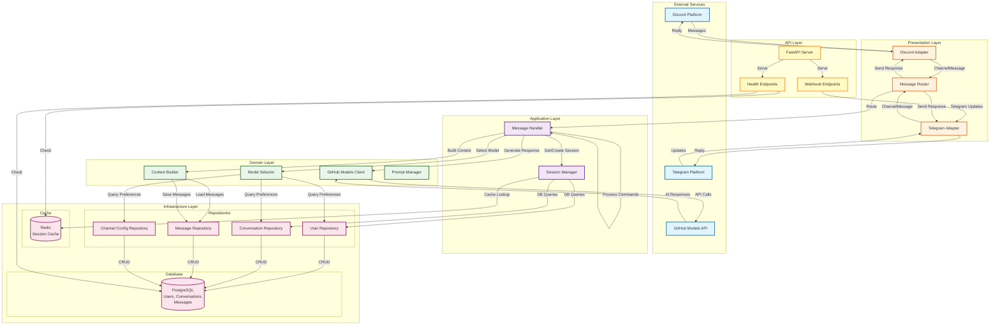
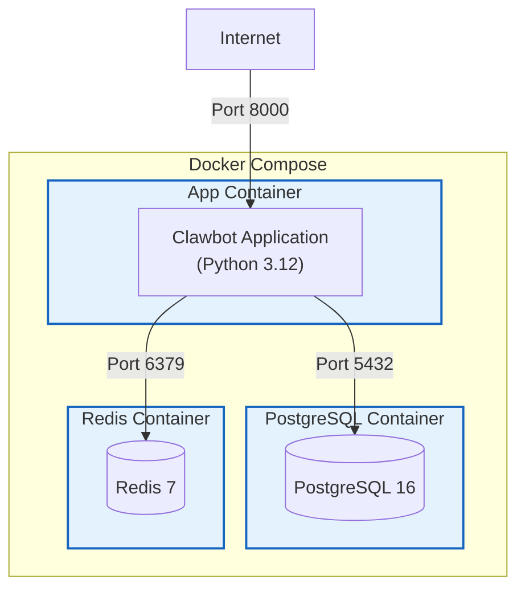
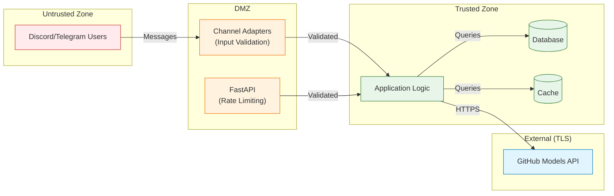

# Component Diagram

This diagram shows the high-level components of the Clawbot AI Agent system and their interactions.

## System Components



## Component Descriptions

### External Services

- **Discord Platform**: Discord messaging service
- **Telegram Platform**: Telegram messaging service
- **GitHub Models API**: AI model inference API (GPT-4, Claude, Llama)

### Presentation Layer

- **Discord Adapter**: Handles Discord bot protocol and message conversion
- **Telegram Adapter**: Handles Telegram bot protocol and message conversion
- **Message Router**: Routes messages between channels and message handler

### Application Layer

- **Message Handler**: Orchestrates message processing workflow
- **Session Manager**: Manages user session lifecycle and caching

### Domain Layer

- **GitHub Models Client**: Communicates with GitHub Models API
- **Model Selector**: Determines which AI model to use
- **Context Builder**: Constructs conversation context from history
- **Prompt Manager**: Manages system prompts and templates

### Infrastructure Layer

- **PostgreSQL**: Persistent storage for users, conversations, and messages
- **Redis**: In-memory cache for active sessions
- **User Repository**: Data access for users
- **Conversation Repository**: Data access for conversations
- **Message Repository**: Data access for messages
- **Channel Config Repository**: Data access for channel configurations

### API Layer

- **FastAPI Server**: HTTP server for webhooks and health checks
- **Health Endpoints**: `/health` and `/ready` endpoints
- **Webhook Endpoints**: Receives webhook callbacks from channels

## Data Flow Patterns

### 1. Message Ingestion (Push)
```
Discord/Telegram → Adapter → Router → Message Handler
```

### 2. Message Processing
```
Message Handler → Session Manager → Repositories → Database
Message Handler → Context Builder → Message Repository
Message Handler → Model Selector → Channel Config Repository
Message Handler → GitHub Client → External API
```

### 3. Response Delivery
```
Message Handler → Router → Adapter → Discord/Telegram
```

### 4. Session Caching
```
Session Manager → Redis (fast path)
Session Manager → Repositories → PostgreSQL (slow path)
```

## Technology Stack

| Layer | Technology |
|-------|------------|
| Channels | discord.py, python-telegram-bot |
| Application | Python 3.12 (asyncio) |
| AI Integration | OpenAI SDK (GitHub Models) |
| Web Framework | FastAPI, Uvicorn |
| Database | PostgreSQL 16, SQLAlchemy (async) |
| Cache | Redis 7, redis-py (async) |
| Container | Docker, Docker Compose |
| Validation | Pydantic v2 |
| Logging | structlog |

## Deployment View



## Security Boundaries


