# Kubernetes Integration Guide

## Overview

The AI agent has full Kubernetes integration, allowing you to manage your Kubernetes clusters directly from Telegram, Discord, or Slack using both **slash commands** and **natural language queries** with intelligent status filtering.

## Features

- 📦 **Pod Management**: List, describe, get logs from pods with status filtering
- 🚀 **Deployment Management**: List and scale deployments
- 🌐 **Service Management**: List services and endpoints
- 🖥️ **Node Management**: List nodes and monitor resource usage
- 🏢 **Namespace Management**: List and work with namespaces
- ⎈ **Helm Support**: List Helm-managed resources
- 📰 **Event Monitoring**: View cluster events
- 🔧 **Configuration**: View contexts and kubeconfig
- 🗣️ **Natural Language**: "show me error pods in production" - intelligent query parsing
- 🔍 **Status Filtering**: Filter pods by error, unhealthy, pending, or running states

## Getting Started

### Prerequisites

1. **Kubernetes Cluster**: Access to a running Kubernetes cluster
2. **Kubeconfig**: Valid kubeconfig file with cluster credentials
3. **kubectl**: Installed on the server running the bot (required)
4. **Permissions**: Appropriate RBAC permissions for cluster operations

### Setup

1. **Install kubectl** on the server:
   ```bash
   # macOS
   brew install kubectl
   
   # Linux
   curl -LO "https://dl.k8s.io/release/$(curl -L -s https://dl.k8s.io/release/stable.txt)/bin/linux/amd64/kubectl"
   chmod +x kubectl
   sudo mv kubectl /usr/local/bin/
   ```

2. **Configure kubeconfig**:
   ```bash
   # Copy your kubeconfig to the server
   mkdir -p ~/.kube
   cp /path/to/your/kubeconfig ~/.kube/config
   
   # Verify connection
   kubectl get nodes
   ```

3. **Restart the bot** - Kubernetes integration is automatic when kubectl is available

### How It Works

The bot executes **real kubectl commands** on your behalf:
- Commands are parsed from natural language or slash commands
- kubectl executes against your configured cluster
- Results are formatted and returned to chat
- Logs are automatically truncated for readability

## Usage

### Natural Language Queries

The bot automatically detects and processes Kubernetes-related queries with intelligent intent detection:

**Basic Queries:**
```
User: show me pods in production namespace
Bot: 📦 Pods in namespace production:
     NAME                     READY   STATUS    RESTARTS   AGE
     api-server-abc123        2/2     Running   0          5d
     nginx-xyz789             1/1     Running   1          12d

User: list all deployments
Bot: 🚀 Deployments (all namespaces):
     NAMESPACE    NAME           READY   UP-TO-DATE   AVAILABLE   AGE
     production   api-server     3/3     3            3           15d

User: what are my nodes
Bot: 🖥️ Nodes:
     NAME           STATUS   ROLES    AGE   VERSION
     master-node    Ready    master   90d   v1.28.0
     worker-node-1  Ready    <none>   90d   v1.28.0
```

**Status Filtering:**

The bot understands status filters to show only relevant pods:

```
User: show me error pods in pos-order4u
Bot: 📦 Pods with issues in namespace pos-order4u:
     NAME                     READY   STATUS             RESTARTS   AGE
     worker-def456            0/1     CrashLoopBackOff   10         2h
     api-backend-ghi789       1/2     Error              5          30m

User: show unhealthy pods in staging
Bot: 📦 Pods not ready in namespace staging:
     NAME                     READY   STATUS    RESTARTS   AGE
     database-jkl012          0/1     Pending   0          5m

User: list failed pods
Bot: 📦 Pods with issues (all namespaces):
     NAMESPACE    NAME                     READY   STATUS       RESTARTS   AGE
     production   cache-mno345             0/1     Failed       0          1h

User: show pending pods
Bot: 📦 Pods pending (all namespaces):
     NAMESPACE    NAME                     READY   STATUS             RESTARTS   AGE
     staging      new-worker-pqr678        0/1     ContainerCreating  0          2m
```

**Status Filter Keywords:**
- **error/failed/crash/crashloop** - Shows pods with: Error, CrashLoopBackOff, ImagePullBackOff, Failed, Unknown, or Running with restarts
- **unhealthy/not ready/notready** - Shows pods where containers aren't all ready
- **pending** - Shows pods in Pending or ContainerCreating state
- **running/healthy/ready** - Shows only healthy Running pods with all containers ready

**Other Natural Language Queries:**
```
"get logs from pod nginx-abc123"
"scale api-server deployment to 3 replicas"
"scale the nginx deployment to 5 replicas in production namespace"
"show services in staging namespace"
"what happened in production namespace"  # Shows events
"show events"
```

**Namespace Detection:**

The bot intelligently extracts namespace from various patterns:
- "in production namespace"
- "in pos-order4u"
- "namespace staging"
- "-n production"

If no namespace is specified, it shows resources from all namespaces.

### Kubernetes Commands

Use the `/k8s` command prefix for direct Kubernetes operations:

#### Pod Management

```bash
# List all pods (all namespaces)
/k8s pods

# List pods in a specific namespace
/k8s pods production
/k8s pods pos-order4u

# Get pod details
/k8s describe pod nginx-deployment-abc123 production

# Get pod logs (last 50 lines)
/k8s logs nginx-deployment-abc123 production

# Get pod logs in default namespace
/k8s logs api-server-xyz789

# Show pod resource usage (requires metrics-server)
/k8s top pods
/k8s top pods production
```

**Pod Log Output:**
- Automatically truncated to last 50 lines for readability
- Shows line count if truncated
- Wrapped in code blocks for easy reading

#### Deployment Management

```bash
# List all deployments (all namespaces)
/k8s deployments

# List deployments in a namespace
/k8s deployments production

# Scale a deployment (namespace defaults to 'default' if not specified)
/k8s scale api-server 5 production
/k8s scale nginx 3
```

#### Service Management

```bash
# List all services (all namespaces)
/k8s services

# List services in a namespace
/k8s services production
```

#### Node Management

```bash
# List all nodes
/k8s nodes

# Show node resource usage (requires metrics-server)
/k8s top nodes

# Describe a node
/k8s describe node worker-node-1
```

**Note:** `/k8s top` commands require [metrics-server](https://github.com/kubernetes-sigs/metrics-server) to be installed in your cluster.

#### Namespace Management

```bash
# List all namespaces
/k8s namespaces
```

#### Helm Management

```bash
# List Helm-managed resources
/k8s helm list

# Note: For full Helm support, install helm CLI on the server
# This command shows Kubernetes resources managed by Helm
```

#### Events and Logs

```bash
# Show all events (all namespaces)
/k8s events

# Show events in a specific namespace
/k8s events production
```

#### Configuration

```bash
# List available contexts
/k8s contexts

# View current kubeconfig (first 20 lines, truncated for security)
/k8s config
```

## Examples

### Example 1: List All Pods in Namespace

**Command:**
```
User: /k8s pods production
```

**Response:**
```
Bot: 📦 Pods in namespace production:

NAME                              READY   STATUS    RESTARTS   AGE       IP            NODE
api-server-abc123                 2/2     Running   0          2d        10.1.0.15     worker-1
frontend-xyz789                   1/1     Running   0          1d        10.1.0.22     worker-2
backend-def456                    1/1     Running   1          12h       10.1.0.33     worker-1
```

### Example 2: Find Error Pods with Natural Language

**Command:**
```
User: show me error pods in pos-order4u
```

**Response:**
```
Bot: 📦 Pods with issues in namespace pos-order4u:

NAME                              READY   STATUS             RESTARTS   AGE       IP            NODE
worker-def456                     0/1     CrashLoopBackOff   10         2h        10.1.0.44     worker-2
api-backend-ghi789                1/2     Error              5          30m       10.1.0.55     worker-1
cache-jkl012                      0/1     ImagePullBackOff   0          15m       <none>        worker-3
```

**Or with command syntax:**
```
User: /k8s pods pos-order4u
Bot: [Shows all pods including healthy ones]
```

### Example 3: Filter Unhealthy Pods

**Command:**
```
User: show unhealthy pods in staging
```

**Response:**
```
Bot: 📦 Pods not ready in namespace staging:

NAME                              READY   STATUS    RESTARTS   AGE       IP            NODE
database-mno345                   0/1     Pending   0          5m        <none>        <none>
worker-pqr678                     1/2     Running   3          1h        10.1.0.66     worker-2
```

### Example 4: All Pods Healthy

**Command:**
```
User: show me error pods in production
```

**Response:**
```
Bot: ✅ No pods with issues found in namespace production

All pods appear to be running normally! 🎉
```

### Example 5: Scale a Deployment

**Command:**
```
User: /k8s scale api-server 5 production
```

**Or natural language:**
```
User: scale api-server deployment to 5 replicas in production
```

**Response:**
```
Bot: ⚖️ Scaling deployment api-server to 5 replicas in namespace production:

deployment.apps/api-server scaled
```

### Example 6: Get Pod Logs

**Command:**
```
User: /k8s logs api-server-abc123 production
```

**Or natural language:**
```
User: get logs from pod api-server-abc123 in production
```

**Response:**
```
Bot: 📜 Logs from pod api-server-abc123 in namespace production:

[2026-02-27 08:30:15] INFO: Server started on port 8080
[2026-02-27 08:30:20] INFO: Connected to database
[2026-02-27 08:35:42] INFO: Received request: GET /api/health
[2026-02-27 08:35:42] INFO: Response: 200 OK
[2026-02-27 08:40:10] INFO: Processing job queue: 15 items
...
(Showing last 50 lines of 1523 total)
```

### Example 7: List Pending Pods

**Command:**
```
User: show pending pods
```

**Response:**
```
Bot: 📦 Pods pending (all namespaces):

NAMESPACE    NAME                              READY   STATUS             RESTARTS   AGE
staging      new-worker-stu901                 0/1     ContainerCreating  0          2m
production   scaler-vwx234                     0/1     Pending            0          5m
```

### Example 8: Monitor Node Resources

**Command:**
```
User: /k8s top nodes
```

**Response:**
```
Bot: 📊 Nodes Resource Usage:

NAME           CPU(cores)   CPU%   MEMORY(bytes)   MEMORY%
master-node    250m         12%    2048Mi          25%
worker-node-1  1200m        60%    4096Mi          51%
worker-node-2  800m         40%    3072Mi          38%
```

**Note:** Requires metrics-server to be installed.

### Example 9: View Cluster Events

**Command:**
```
User: /k8s events production
```

**Or natural language:**
```
User: what happened in production namespace
```

**Response:**
```
Bot: 📰 Events in namespace production:

LAST SEEN   TYPE      REASON              OBJECT                        MESSAGE
2m          Normal    Scheduled           pod/api-server-abc123         Successfully assigned...
5m          Warning   BackOff             pod/worker-def456             Back-off restarting failed container
8m          Normal    Pulling             pod/frontend-xyz789           Pulling image...
10m         Normal    Created             pod/frontend-xyz789           Created container
```

### Example 10: List Healthy Running Pods

**Command:**
```
User: show running pods in production
```

**Or:**
```
User: show healthy pods
```

**Response:**
```
Bot: 📦 Pods running in namespace production:

NAME                              READY   STATUS    RESTARTS   AGE       IP            NODE
api-server-abc123                 2/2     Running   0          2d        10.1.0.15     worker-1
frontend-xyz789                   1/1     Running   0          1d        10.1.0.22     worker-2
backend-ghi789                    3/3     Running   0          12h       10.1.0.33     worker-1
```

## Architecture

### Components

```
┌─────────────────────────────────────────────────┐
│         Telegram / Discord / Slack              │
└───────────────────┬─────────────────────────────┘
                    │
            ┌───────▼────────┐
            │  Message       │
            │  Handler       │
            └───────┬────────┘
                    │
        ┌───────────┴──────────┐
        │                      │
┌───────▼────────┐    ┌───────▼──────────┐
│  AI Model      │    │  Kubernetes      │
│  Processing    │    │  Handler         │
└────────────────┘    └───────┬──────────┘
                              │
                      ┌───────▼──────────┐
                      │  Kubernetes      │
                      │  MCP Tools       │
                      └───────┬──────────┘
                              │
                      ┌───────▼──────────┐
                      │  kubectl /       │
                      │  Kubernetes API  │
                      └──────────────────┘
```

### Flow Diagram

```mermaid
sequenceDiagram
    participant User
    participant Bot
    participant MessageHandler
    participant K8sHandler
    participant MCPTools
    participant K8sAPI

    User->>Bot: "list pods in production"
    Bot->>MessageHandler: Detect K8s query
    MessageHandler->>MessageHandler: Check K8s keywords
    MessageHandler->>K8sHandler: Route to K8s handler
    K8sHandler->>MCPTools: mcp_kubernetes_pods_list(namespace="production")
    MCPTools->>K8sAPI: GET /api/v1/namespaces/production/pods
    K8sAPI-->>MCPTools: Pod list
    MCPTools-->>K8sHandler: Formatted pod data
    K8sHandler-->>MessageHandler: Formatted response
    MessageHandler-->>Bot: Response message
    Bot-->>User: "📦 Pods in production: ..."
```



## Available MCP Tools

The following Kubernetes MCP tools are integrated:

### Pod Management
- `mcp_kubernetes_pods_list` - List pods
- `mcp_kubernetes_pods_get` - Get pod details
- `mcp_kubernetes_pods_log` - Get pod logs
- `mcp_kubernetes_pods_delete` - Delete a pod
- `mcp_kubernetes_pods_run` - Run a pod
- `mcp_kubernetes_pods_exec` - Execute command in pod
- `mcp_kubernetes_pods_top` - Get pod resource usage

### Resource Management
- `mcp_kubernetes_resources_list` - List any resource type
- `mcp_kubernetes_resources_get` - Get resource details
- `mcp_kubernetes_resources_create_or_update` - Create/update resource
- `mcp_kubernetes_resources_delete` - Delete a resource
- `mcp_kubernetes_resources_scale` - Scale a resource

### Node Management
- `mcp_kubernetes_nodes_log` - Get node logs
- `mcp_kubernetes_nodes_stats_summary` - Get node statistics
- `mcp_kubernetes_nodes_top` - Get node resource usage

### Namespace Management
- `mcp_kubernetes_namespaces_list` - List namespaces

### Helm Management
- `mcp_kubernetes_helm_install` - Install Helm chart
- `mcp_kubernetes_helm_list` - List Helm releases
- `mcp_kubernetes_helm_uninstall` - Uninstall Helm release

### Event Management
- `mcp_kubernetes_events_list` - List events

### Configuration Management
- `mcp_kubernetes_configuration_contexts_list` - List contexts
- `mcp_kubernetes_configuration_view` - View kubeconfig

## Security Considerations

### Permissions

The bot operates with the permissions of the configured kubeconfig. Ensure:

1. ✅ Use least-privilege service accounts
2. ✅ Restrict namespace access where possible
3. ✅ Avoid cluster-admin permissions unless necessary
4. ✅ Regularly rotate credentials
5. ✅ Enable RBAC in your cluster

### Best Practices

```yaml
# Example: Read-only service account
apiVersion: v1
kind: ServiceAccount
metadata:
  name: bot-readonly
  namespace: production
---
apiVersion: rbac.authorization.k8s.io/v1
kind: Role
metadata:
  name: bot-readonly-role
  namespace: production
rules:
- apiGroups: [""]
  resources: ["pods", "services", "configmaps"]
  verbs: ["get", "list"]
- apiGroups: ["apps"]
  resources: ["deployments", "statefulsets"]
  verbs: ["get", "list"]
---
apiVersion: rbac.authorization.k8s.io/v1
kind: RoleBinding
metadata:
  name: bot-readonly-binding
  namespace: production
subjects:
- kind: ServiceAccount
  name: bot-readonly
  namespace: production
roleRef:
  kind: Role
  name: bot-readonly-role
  apiGroup: rbac.authorization.k8s.io
```

### Audit Logging

All Kubernetes operations are logged:

```json
{
  "timestamp": "2026-02-27T08:30:15Z",
  "level": "info",
  "event": "kubernetes_query_detected",
  "channel_type": "telegram",
  "user_id": "5636170508",
  "command": "/k8s pods production"
}
```

## Troubleshooting

### Common Issues

#### 1. "Kubernetes tools not available"

**Problem**: MCP tools are not loaded.

**Solution**:
```bash
# Check if VS Code has Kubernetes extensions installed
code --list-extensions | grep kubernetes

# Ensure the Kubernetes MCP extension is enabled
```

#### 2. "Access denied" or "Forbidden"

**Problem**: Insufficient permissions in kubeconfig.

**Solution**:
```bash
# Check current context
kubectl config current-context

# Check permissions
kubectl auth can-i get pods --namespace production

# Switch to correct context
kubectl config use-context my-cluster
```

#### 3. "Context not found"

**Problem**: Kubeconfig not accessible.

**Solution**:
```bash
# Verify kubeconfig location
echo $KUBECONFIG

# Set kubeconfig path
export KUBECONFIG=~/.kube/config

# Test connection
kubectl cluster-info
```

#### 4. "Connection refused"

**Problem**: Cluster is not reachable.

**Solution**:
```bash
# Check cluster connection
kubectl cluster-info

# Verify VPN/network connectivity
ping <cluster-api-server>

# Check kubeconfig server URL
kubectl config view --minify
```

### Debug Mode

Enable verbose logging for Kubernetes operations:

```python
# In src/services/kubernetes_handler.py
logger.setLevel("DEBUG")
```

View logs:
```bash
# Application logs
docker-compose logs -f app | grep kubernetes

# Or in development
tail -f logs/app.log | grep kubernetes
```

## Advanced Usage

### Multi-Cluster Management

Switch between different Kubernetes clusters:

```bash
# List available contexts
/k8s contexts

# The bot will show:
# - k3s-ssh-tunnel (current)
# - k3s-vpn-direct
# - k3s-vpn-malaysia-2
# - production-cluster
# - staging-cluster
```

### Custom Namespaces

Set a default namespace for your session:

```bash
# All subsequent commands will use this namespace
/k8s set-namespace production

# Now these are equivalent:
/k8s pods
/k8s pods production
```

### Resource Monitoring

Set up continuous monitoring:

```bash
# Watch pod status (updates every 30s)
/k8s watch pods production

# Monitor node resources
/k8s watch nodes

# Stop watching
/k8s unwatch
```

## Integration with AI Models

### Natural Language Processing

The bot can interpret natural language queries about Kubernetes:

```
User: "What pods are running in production?"
Bot: [Interprets as /k8s pods production]

User: "Scale my API to 5 instances"
Bot: "To scale the API deployment, use: /k8s scale api-server 5 <namespace>"

User: "Why is my pod crashing?"
Bot: [Uses AI to analyze pod events and logs]
```

### AI-Powered Troubleshooting

```
User: "My deployment isn't working"
Bot: "Let me check... [runs /k8s describe deployment <name>]
      I see the issue: ImagePullBackOff error. The container image 
      'myapp:latest' cannot be pulled. Check:
      1. Image name and tag
      2. Image registry access
      3. imagePullSecrets configuration"
```

## Future Enhancements

- [ ] Real-time streaming of pod logs
- [ ] Interactive deployment rollbacks
- [ ] Automated incident response
- [ ] Multi-cluster aggregated views
- [ ] GitOps integration for deployments
- [ ] Cost analysis and optimization suggestions
- [ ] Security vulnerability scanning
- [ ] Automated scaling recommendations

## Support

For issues or questions:
- GitHub Issues: [Your repository]
- Documentation: [docs/kubernetes-integration.md](kubernetes-integration.md)
- Slack: #bot-support

## License

MIT License - see LICENSE file
