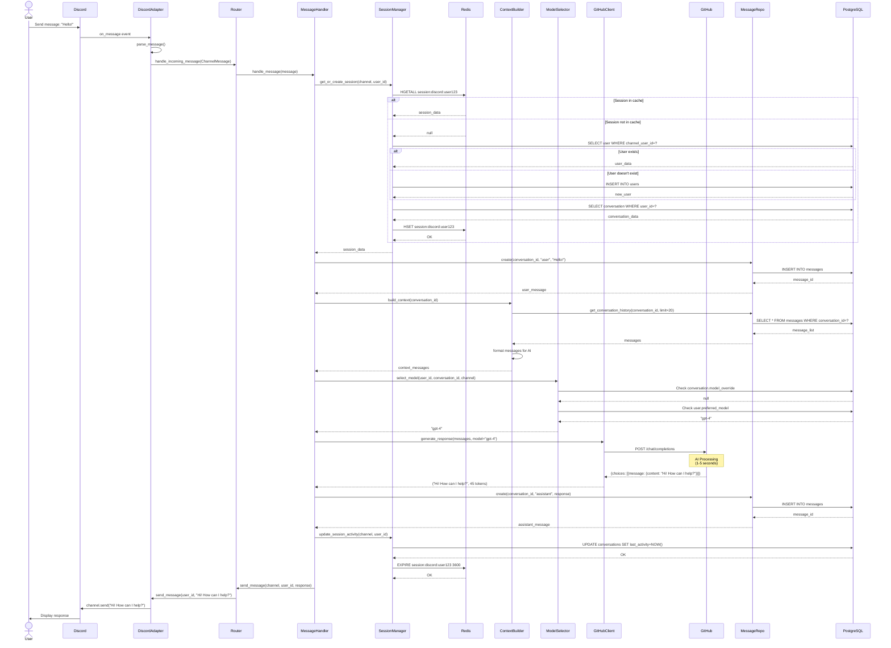
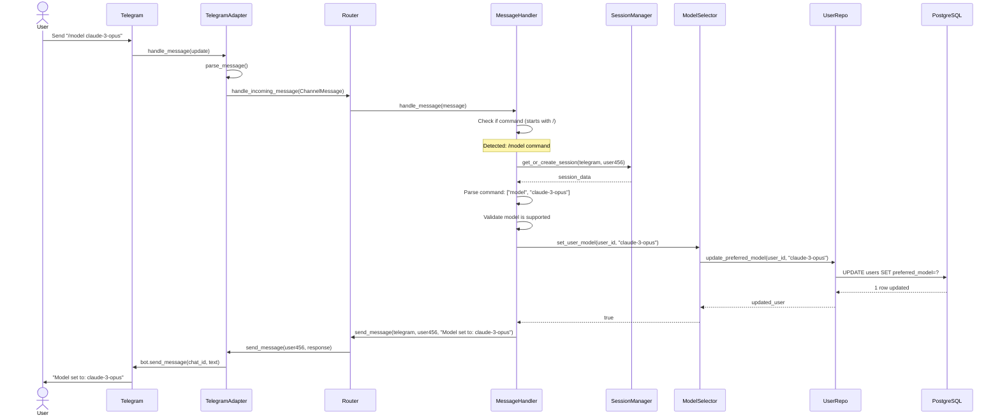
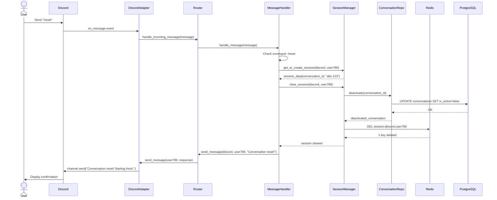
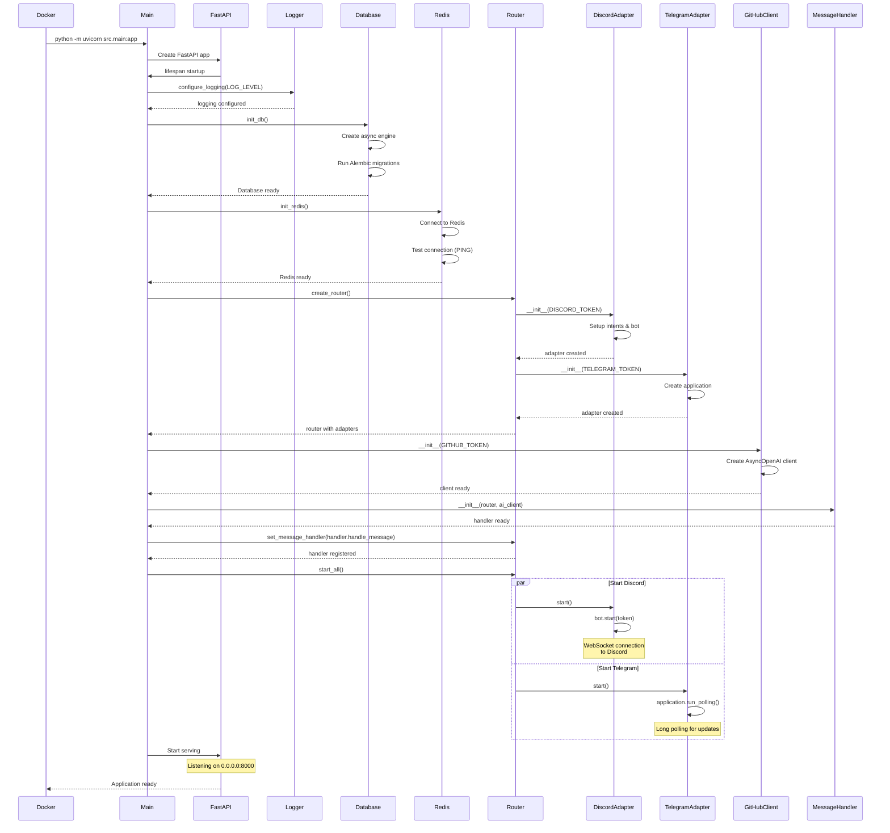
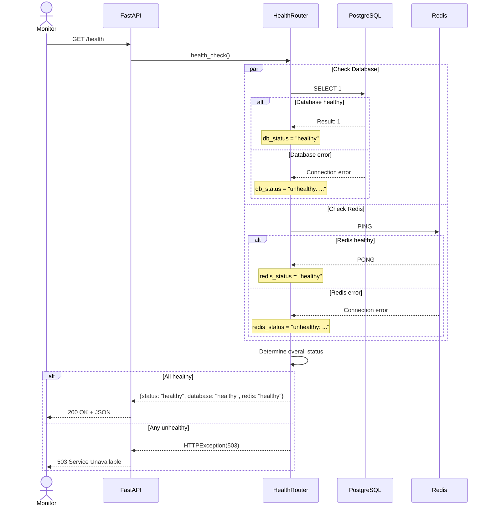
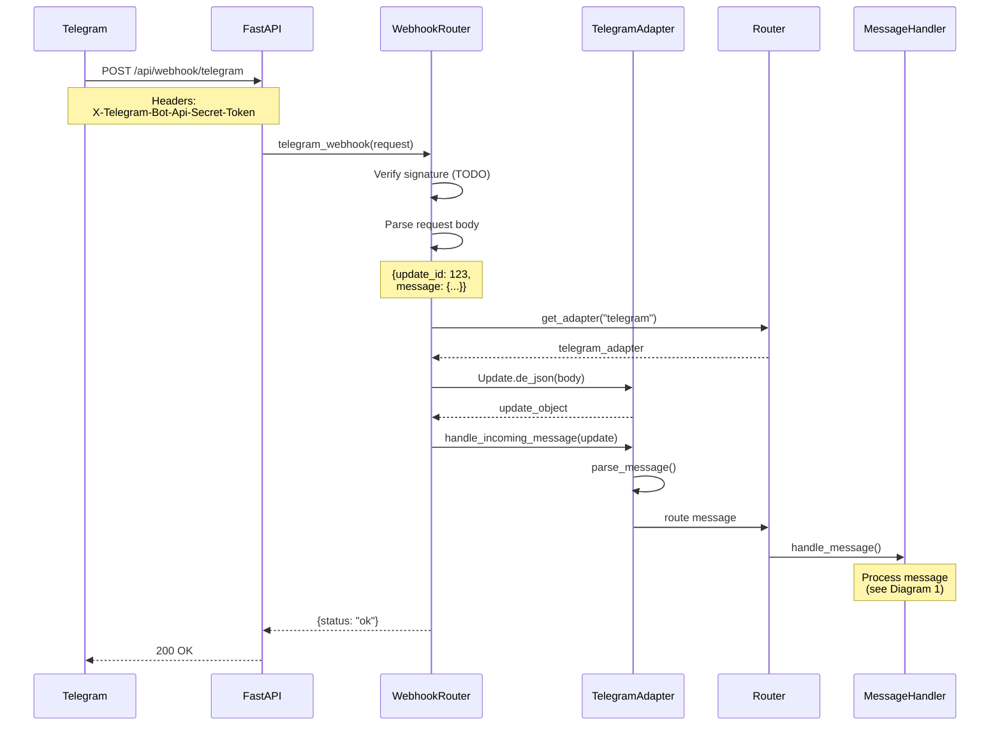

# Sequence Diagrams

This document contains sequence diagrams showing the interactions between components for key use cases.

## 1. User Message Processing Flow

This diagram shows the complete flow of processing a user message and generating an AI response.

## 2. Command Processing Flow (/model)

This diagram shows how a user changes their preferred AI model.

## 3. Session Reset Flow (/reset)

This diagram shows how a conversation is reset.

## 4. Application Startup Flow

This diagram shows the initialization sequence when the application starts.

## 5. Health Check Flow

This diagram shows the health check endpoint operation.

## 6. Telegram Webhook Flow

This diagram shows how Telegram webhooks are processed (alternative to polling).

## Key Observations

### Performance Optimizations

1. **Session Caching**: Redis cache prevents database queries on every message
2. **Connection Pooling**: Reuse database connections across requests
3. **Async I/O**: Non-blocking operations allow high concurrency
4. **Message Batching**: Can batch database writes for better throughput

### Error Handling

1. **Retry Logic**: GitHub API calls retry with exponential backoff
2. **Graceful Degradation**: If AI fails, send error message to user
3. **Health Checks**: Continuous monitoring of dependencies
4. **Circuit Breaker**: (Future) Prevent cascading failures

### Security Measures

1. **Input Validation**: All user input validated at adapter layer
2. **Rate Limiting**: FastAPI middleware limits request rate
3. **Signature Verification**: Webhook signatures verified
4. **SQL Injection**: Parameterized queries via SQLAlchemy

### Scalability Patterns

1. **Stateless Design**: No in-memory state, can scale horizontally
2. **Load Balancing**: Multiple app instances behind load balancer
3. **Database Read Replicas**: (Future) Separate read/write workloads
4. **Cache Warming**: (Future) Pre-populate cache for active users
