# Sequence Diagrams

This document contains sequence diagrams showing the interactions between components for key use cases.

## 1. User Message Processing Flow

This diagram shows the complete flow of processing a user message and generating an AI response.


## 2. Command Processing Flow (/model)

This diagram shows how a user changes their preferred AI model.


## 3. Session Reset Flow (/reset)

This diagram shows how a conversation is reset.


## 4. Application Startup Flow

This diagram shows the initialization sequence when the application starts.


## 5. Health Check Flow

This diagram shows the health check endpoint operation.


## 6. Telegram Webhook Flow

This diagram shows how Telegram webhooks are processed (alternative to polling).


## Key Observations

### Performance Optimizations

1. **Session Caching**: Redis cache prevents database queries on every message
2. **Connection Pooling**: Reuse database connections across requests
3. **Async I/O**: Non-blocking operations allow high concurrency
4. **Message Batching**: Can batch database writes for better throughput

### Error Handling

1. **Retry Logic**: GitHub API calls retry with exponential backoff
2. **Graceful Degradation**: If AI fails, send error message to user
3. **Health Checks**: Continuous monitoring of dependencies
4. **Circuit Breaker**: (Future) Prevent cascading failures

### Security Measures

1. **Input Validation**: All user input validated at adapter layer
2. **Rate Limiting**: FastAPI middleware limits request rate
3. **Signature Verification**: Webhook signatures verified
4. **SQL Injection**: Parameterized queries via SQLAlchemy

### Scalability Patterns

1. **Stateless Design**: No in-memory state, can scale horizontally
2. **Load Balancing**: Multiple app instances behind load balancer
3. **Database Read Replicas**: (Future) Separate read/write workloads
4. **Cache Warming**: (Future) Pre-populate cache for active users

## 7. MCP Multi-Server Initialization Flow

This diagram shows the new multi-transport MCP architecture supporting both stdio and SSE servers.


## 8. Security Scanning with SSE MCP Server

This diagram shows how security queries are routed to the simplePortChecker MCP server.

```mermaid
sequenceDiagram
    actor User
    participant Telegram
    participant TelegramAdapter
    participant MessageHandler
    participant MCPManager
    participant SSETransport
    participant PortChecker as SimplePortChecker<br/>(SSE Server)

    User->>Telegram: "is port 443 open on lobehub.com"
    Telegram->>TelegramAdapter: handle_message(update)
    TelegramAdapter->>MessageHandler: handle_message(ChannelMessage)
    
    MessageHandler->>MessageHandler: _is_security_query()
    Note over MessageHandler: Detected: port, open keywords
    
    MessageHandler->>MessageHandler: Parse query with regex
    Note over MessageHandler: port_pattern matches:<br/>port=443, host=lobehub.com
    
    MessageHandler->>MCPManager: list_all_tools()
    MCPManager-->>MessageHandler: [{name: "scan_ports", _server: "simplePortChecker"}, ...]
    
    MessageHandler->>MessageHandler: Filter tools by server="simplePortChecker"
    MessageHandler->>MessageHandler: Select tool: scan_ports
    
    MessageHandler->>MCPManager: call_tool("scan_ports", {target: "lobehub.com", ports: [443]})
    
    MCPManager->>MCPManager: Lookup tool_registry["scan_ports"]
    Note over MCPManager: Found server: simplePortChecker
    
    MCPManager->>SSETransport: call_tool("scan_ports", arguments)
    
    SSETransport->>SSETransport: Build JSON-RPC request<br/>{method: "tools/call", params: {...}}
    
    SSETransport->>PortChecker: POST /mcp<br/>Headers: Accept: application/json, text/event-stream
    
    Note over PortChecker: Port scanning in progress...
    
    PortChecker-->>SSETransport: event: message\ndata: {"method": "notifications/message", "params": {"level": "info"}}
    Note over SSETransport: Progress notification (ignored)
    
    PortChecker-->>SSETransport: event: message\ndata: {"method": "notifications/message", "params": {"level": "info"}}
    Note over SSETransport: Another progress notification
    
    PortChecker-->>SSETransport: event: message\ndata: {"jsonrpc": "2.0", "id": 3, "result": {content: [...]}}
    Note over SSETransport: Final result with matching ID
    
    SSETransport->>SSETransport: Parse SSE response:<br/>1. Split by newlines<br/>2. Find lines with "data: "<br/>3. Parse JSON<br/>4. Match request ID
    
    SSETransport-->>MCPManager: {"content": [{"type": "text", "text": "{...}"}], "isError": false}
    
    MCPManager-->>MessageHandler: Tool result
    
    MessageHandler->>MessageHandler: _format_tool_result()
    Note over MessageHandler: Format with icon and title:<br/>"🔌 Port Scan"
    
    MessageHandler->>TelegramAdapter: send_message(response)
    TelegramAdapter->>Telegram: bot.send_message()
    Telegram->>User: "🔌 Port Scan\n\nTarget: lobehub.com\n\nPort 443: open (https)"
```



## 9. Kubernetes Query with Natural Language Processing

This diagram shows the enhanced Kubernetes integration with NLP query parsing.

```mermaid
sequenceDiagram
    actor User
    participant Discord
    participant DiscordAdapter
    participant MessageHandler
    participant MCPManager
    participant StdioTransport
    participant K8sServer
    participant Kubectl

    User->>Discord: "show me error pods in pos-order4u"
    Discord->>DiscordAdapter: on_message event
    DiscordAdapter->>MessageHandler: handle_message(ChannelMessage)
    
    MessageHandler->>MessageHandler: _is_kubernetes_query()
    Note over MessageHandler: Detected: pods keyword
    
    MessageHandler->>MessageHandler: _handle_kubernetes_query()
    MessageHandler->>MessageHandler: Parse natural language query
    Note over MessageHandler: Extracted:<br/>- action: "show/list"<br/>- resource: "pods"<br/>- namespace: "pos-order4u"<br/>- filter: "error"
    
    MessageHandler->>MCPManager: call_tool("k8s_get_pods", {namespace: "pos-order4u"})
    
    MCPManager->>MCPManager: Lookup tool in registry
    Note over MCPManager: Found: kubernetes server
    
    MCPManager->>StdioTransport: call_tool("k8s_get_pods", args)
    
    StdioTransport->>K8sServer: {"jsonrpc": "2.0", "method": "tools/call",<br/>"params": {"name": "k8s_get_pods", "arguments": {namespace: "pos-order4u"}}}
    Note over K8sServer: Via stdin
    
    K8sServer->>Kubectl: subprocess: kubectl get pods -n pos-order4u -o json
    Kubectl-->>K8sServer: JSON output with pod list
    
    K8sServer->>K8sServer: Filter and format pods
    K8sServer-->>StdioTransport: {"jsonrpc": "2.0", "id": 1, "result": {"content": [{"type": "text", "text": "..."}]}}
    Note over StdioTransport: Via stdout
    
    StdioTransport-->>MCPManager: Tool result
    MCPManager-->>MessageHandler: Pod data
    
    MessageHandler->>MessageHandler: Apply status filter: "error"
    Note over MessageHandler: Filter for:<br/>- CrashLoopBackOff<br/>- Error<br/>- ImagePullBackOff
    
    MessageHandler->>MessageHandler: Format output with emojis
    Note over MessageHandler: ❌ for error pods<br/>Pod name, status, restarts
    
    MessageHandler->>DiscordAdapter: send_message()
    DiscordAdapter->>Discord: channel.send()
    Discord->>User: "📦 Pods with issues in namespace pos-order4u:\n\n❌ worker-def456\nStatus: CrashLoopBackOff | Restarts: 10"
```



## 10. Application Shutdown with MCP Cleanup

This diagram shows the graceful shutdown sequence including MCP server cleanup.


## Key Improvements in Multi-Transport MCP Architecture

### Protocol Support

1. **stdio Transport**: 
   - Subprocess-based communication
   - Standard input/output JSON-RPC
   - Local server processes
   - Used by: Kubernetes MCP server

2. **SSE Transport**: 
   - HTTP-based communication
   - Server-Sent Events protocol
   - Remote cloud servers
   - Used by: SimplePortChecker MCP server

### Server-Sent Events (SSE) Handling

**Format**: SSE responses contain multiple messages:
```
event: message
data: {"method":"notifications/message",...}

event: message
data: {"jsonrpc":"2.0","id":3,"result":{...}}
```

**Parsing Strategy**:
1. Split response by newlines
2. Find all lines starting with `data: `
3. Parse each as JSON
4. Match response by request ID
5. Ignore notifications, return final result

### Tool Registry Architecture

**Purpose**: Route tool calls to correct MCP server

**Structure**:
```python
tool_registry = {
    "scan_ports": "simplePortChecker",
    "analyze_certificate": "simplePortChecker",
    "k8s_get_pods": "kubernetes",
    "k8s_scale_deployment": "kubernetes",
    # ... 21 total tools
}
```

**Benefits**:
- Single unified interface for all tools
- Automatic routing to appropriate server
- Support for unlimited MCP servers
- Type-based server instantiation

### Security Scanning Integration

**8 Security Tools Available**:
1. **scan_ports** - Port scanning and service detection
2. **analyze_certificate** - SSL/TLS certificate analysis
3. **detect_l7_protection** - WAF/CDN detection (Cloudflare, AWS, Azure)
4. **check_mtls** - Mutual TLS verification
5. **check_security_headers** - HSTS, CSP, CORS analysis
6. **scan_owasp_vulnerabilities** - OWASP Top 10 scanning
7. **full_security_scan** - Comprehensive security assessment
8. **check_hybrid_identity** - Azure AD Hybrid Identity detection

**Natural Language Support**:
- "is port 443 open on lobehub.com"
- "check certificate for example.com"
- "detect waf on site.com"
- "full security scan on api.example.com"

### Configuration Format

**`.mcp-config.json`**:
```json
{
  "mcpServers": {
    "kubernetes": {
      "type": "stdio",
      "command": "python3",
      "args": ["scripts/mcp_server.py"],
      "description": "Kubernetes management tools"
    },
    "simplePortChecker": {
      "type": "sse",
      "url": "https://mcp.simpleportchecker.com/mcp",
      "description": "Port checking and security tools"
    }
  }
}
```

**Environment Variables** (optional):
```json
{
  "env": {
    "KUBECONFIG": "~/.kube/config"
  }
}
```

